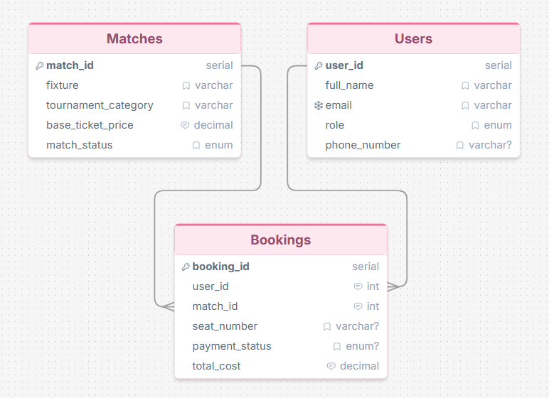

# Football Ticket Booking System — Database Design & SQL Queries

## Overview
A simplified database system for managing football ticket bookings built with SQL.

## ERD Diagram

🔗 **ERD Link:** [Click to View ERD](https://drawsql.app/teams/rayhan-draw/diagrams/ticket-booking)

## Database Schema
Three tables: **Users**, **Matches**, and **Bookings**

- `Users` — stores fan and staff account information
- `Matches` — stores football fixtures and ticket availability
- `Bookings` — records individual ticket purchases

## Files
| File | Description |
|------|-------------|
| `QUERY.sql` | Schema creation, data seeding, and SQL queries |
| `erd-diagram.png` | ERD diagram image |

## Tools Used
- PostgreSQL
- Beekeeper Studio
- DrawSQL

## How to Run
1. Open PostgreSQL or Beekeeper Studio
2. Run `QUERY.sql` top to bottom